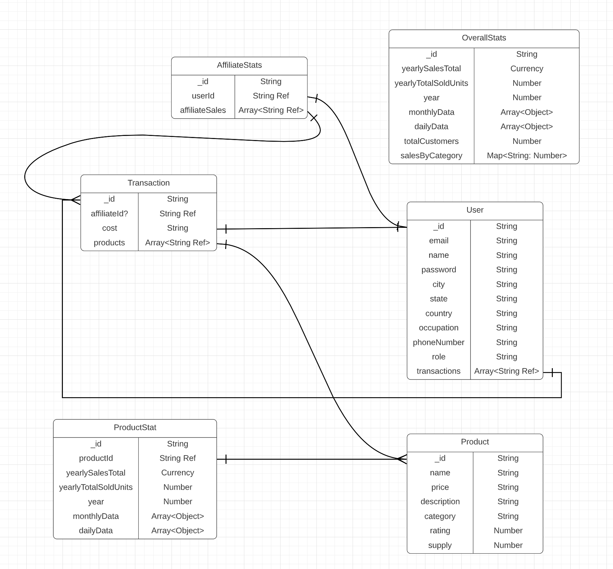

# admindash
ECOMVISION - an all-in-one admin dashboard for businesses. With ECOMVISION, managing and analyzing your business data has never been easier. Keep track of your sales figures, customer engagement metrics, and more - all on one sleek and intuitive platform. I designed ECOMVISION with the user in mind, incorporating modern design elements and easy-to-use features. Plus, with cutting-edge technologies like the MERN stack, Node JS, and MongoDB, you can count on speed and reliability.
  

## Installation
If you would like to run the application on your local machine, head over to the Client folder README for instructions.

You can also view the webpage through the link below. 

**NOTE** The first time you visit the webpage it will take a minute for the api to fetch data

[Deployed Site](https://adminclient-nfme.onrender.com/dashboard)


## Code Snippets

### Aggregate Calls

`getTransactions` is an asynchronous function that retrieves a list of transactions based on specified query parameters, including page number, page size, sorting criteria, and search text. It then returns the list of transactions and the total count of transactions matching the search criteria in JSON format. If there is an error while processing the request, the function returns a JSON error message.

```js
export const getTransactions = async (req, res) => {
    try {
        // Get query parameters
        const { page = 1, pageSize = 20, sort = null, search = "" } = req.query;

        // Generate sort object from query parameter
        const generateSort = () => {
            const sortParsed = JSON.parse(sort);
            const sortFormatted = {
                [sortParsed.field]: (sortParsed.sort = "asc" ? 1 : -1),
            };

            return sortFormatted;
        };
        const sortFormatted = Boolean(sort) ? generateSort() : {};

        // Find transactions matching the search query, sort them, and paginate the results
        const transactions = await Transaction.find({
            $or: [
                { cost: { $regex: new RegExp(search, "i") } },
                { userId: { $regex: new RegExp(search, "i") } },
            ],
        })
            .sort(sortFormatted)
            .skip(page * pageSize)
            .limit(pageSize);

        // Get the total number of transactions matching the search query
        const total = await Transaction.countDocuments({
            name: { $regex: search, $options: "i" },
        });

        // Return the list of transactions and the total count
        res.status(200).json({
            transactions,
            total,
        });
    } catch (error) {
        res.status(404).json({ message: error.message });
    }
};
```





## Project Tools

### Technologies Used

- **MERN stack**: [MongoDB](https://www.mongodb.com/), [Express JS](https://expressjs.com/), [React](https://reactjs.org/), and [Node.js](https://nodejs.org/) for the full stack development.
- **Material UI**: [Material UI](https://mui.com/) for styling the front-end components.
- **Material UI Data Grid**: [Material UI Data Grid](https://mui.com/components/data-grid/) for creating tables in the front-end.
- **Nivo**: [Nivo](https://nivo.rocks/) for creating charts in the front-end.
- **Redux Toolkit**: [Redux Toolkit](https://redux-toolkit.js.org/) for managing the front-end state.
- **Redux Toolkit Query**: [Redux Toolkit Query](https://redux-toolkit.js.org/rtk-query/overview) for making API calls in the front-end.
- **Entity Relationship Diagram**: to model the data and organize the back-end.
- **Render**: [Render](https://render.com/) for deployment of the application.

### Packages Used

- [npm](https://www.npmjs.com/) for package management.
- [npx](https://www.npmjs.com/package/npx) for executing certain packages.
- [Express](https://www.npmjs.com/package/express) for our framework for APIs.
- [body-parser](https://www.npmjs.com/package/body-parser) for parsing our data coming in.
- [cors](https://www.npmjs.com/package/cors) for cross-origin resource sharing.
- [dotenv](https://www.npmjs.com/package/dotenv) for environment variables.
- [helmet](https://www.npmjs.com/package/helmet) for protecting our APIs.
- [Mongoose](https://www.npmjs.com/package/mongoose) for handling MongoDB calls.
- [nodemon](https://www.npmjs.com/package/nodemon) for live server reload.


## Contributing

Pull requests are welcome. For major changes, please open an issue first to discuss what you would like to change.
## License

MIT License

Copyright (c) [2022] [Jorge Zamora]

Permission is hereby granted, free of charge, to any person obtaining a copy
of this software and associated documentation files (the "Software"), to deal
in the Software without restriction, including without limitation the rights
to use, copy, modify, merge, publish, distribute, sublicense, and/or sell
copies of the Software, and to permit persons to whom the Software is
furnished to do so, subject to the following conditions:

The above copyright notice and this permission notice shall be included in all
copies or substantial portions of the Software.

THE SOFTWARE IS PROVIDED "AS IS", WITHOUT WARRANTY OF ANY KIND, EXPRESS OR
IMPLIED, INCLUDING BUT NOT LIMITED TO THE WARRANTIES OF MERCHANTABILITY,
FITNESS FOR A PARTICULAR PURPOSE AND NONINFRINGEMENT. IN NO EVENT SHALL THE
AUTHORS OR COPYRIGHT HOLDERS BE LIABLE FOR ANY CLAIM, DAMAGES OR OTHER
LIABILITY, WHETHER IN AN ACTION OF CONTRACT, TORT OR OTHERWISE, ARISING FROM,
OUT OF OR IN CONNECTION WITH THE SOFTWARE OR THE USE OR OTHER DEALINGS IN THE
SOFTWARE.

[](https://github.com/jbxamora)  [](https://www.linkedin.com/in/jorge-zamora-786945250//)  [](https://www.instagram.com/jbxamora/)  [](https://stackoverflow.com/users/20023706/jbxamora)
